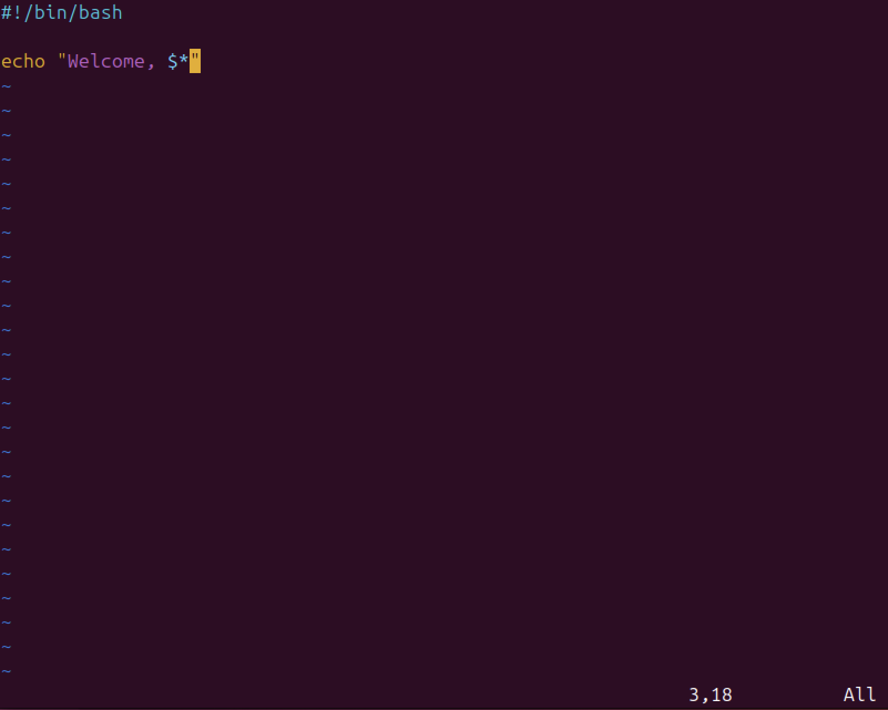

# Лабораторная работа 1

Сдалал: `Ахмедов Бахадыр`

## Шаг 1
* Для того чтобы модифицировать файл `script.bash` открываем файл используя любой текстовый редактор, в моем случае это `vim`

* Содержимое файла `script.bash`:

## Шаг 2
* Заменяем строку `echo "Welcome to ITMO University"` на `"Welcome, $*"` где специальная переменная `$*"` выведит список всех позиционных аргументов, для того чтобы изменить строку в `vim` нажимаем  `I` для чтобы перейти в `Insert mode` 

 * Затем нажимаем `Esc` для того чтобы перейти в `Normal mode`

 * Зажимае `Shift + :` прописываем `wq` для того чтобы сохранить изменения и выйти из файла, нажимаем `Enter`

## Шаг 3
* Проверяем `script.bash` на работоспособность передаем два аргумента `Vasya Pupkin`

* Вводим большее количество аргументов `Benedict Timothy Carlton Cumberbatch`

